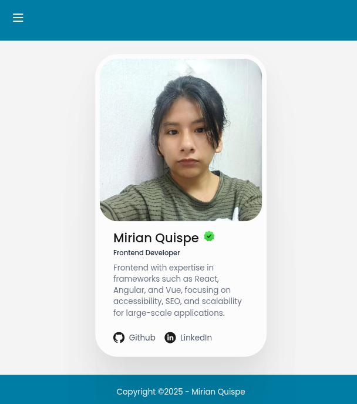

# Microfrontend Project with Module Federation

This project demonstrates a **microfrontend architecture** using **Module Federation** with **Rspack**, **React**, and **TypeScript**. It consists of two applications: **Home** 🏠 and **About** 📄, which share components and styles dynamically at runtime.

## Overview 📖

- **Home App** (port `3000`): Exposes reusable `Header` and `Footer` components, along with global styles.
- **About App** (port `3001`): Consumes `Header` and `Footer` from the Home app and integrates a `Profile` component.
- Both apps leverage **Module Federation** to share `react` and `react-dom` dependencies, ensuring optimized bundle sizes.

<div align="center">
   
</div>

## Tech Stack 🛠️

- **Rspack**: Next-gen bundler for fast builds ⚡
- **React**: UI library for component-based architecture
- **TypeScript**: Static typing for robust code
- **Module Federation**: Dynamic module sharing between apps
- **Zephyr Plugin**: Enhances Rspack configuration
- **PostCSS**: CSS processing with Tailwind-compatible features
- **SWC**: Super-fast JavaScript/TypeScript compiler

## Features ✨

- 📡 **Dynamic Component Sharing**: Home app exposes `Header` and `Footer`, consumed by About app.
- 🎨 **Shared Styles**: Global CSS from Home app applied in About app.
- ⚙️ **Hot Module Replacement**: Enabled in development with React Refresh.
- 🌐 **CORS Support**: Configured for seamless cross-app communication.
- 🔍 **Browser Compatibility**: Supports modern browsers (Chrome ≥ 87, Edge ≥ 88, Firefox ≥ 78, Safari ≥ 14).

## Project Structure 🗂️

```
├── home/
│   ├── src/
│   │   ├── components/
│   │   │   ├── header.tsx
│   │   │   └── footer.tsx
│   │   ├── index.css
│   │   └── index.ts
│   └── module-federation.config.js
├── about/
│   ├── src/
│   │   ├── components/
│   │   │   └── profile.tsx
│   │   ├── index.css
│   │   └── index.ts
│   └── module-federation.config.js
```

## Getting Started 🏃‍♂️

### Prerequisites

- Node.js (v16 or higher)
- npm or yarn

### Installation

1. Clone the repository:
   ```bash
   git clone https://github.com/Mirian97/microfronted-with-rspack.git
   ```
2. Navigate to each app folder (`home` and `about`) and install dependencies:
   ```bash
   cd home && npm install
   cd ../about && npm install
   ```

### Running the Apps

1. Start the **Home** app:
   ```bash
   cd home
   npm start
   ```
   Access at `http://localhost:3000`
2. Start the **About** app:
   ```bash
   cd about
   npm start
   ```
   Access at `http://localhost:3001`

### Development

- Both apps run in development mode with hot reloading enabled 🔥.
- Modify files in `src/` to see changes instantly.

### Build

To create production builds:

```bash
cd home && npm run build
cd ../about && npm run build
```

## Module Federation Config 🧩

- **Home App**:
  - Exposes: `Header`, `Footer`, and `styles`
  - Unique name: `home`
  - Public path: `http://localhost:3000/`
- **About App**:
  - Consumes: `home/Header`, `home/Footer`, `home/styles`
  - Unique name: `about`
  - Public path: `http://localhost:3001/`
- Shared dependencies: `react`, `react-dom`

## Contributing 🤝

1. Fork the repository.
2. Create a feature branch (`git checkout -b feature/new-feature`).
3. Commit changes (`git commit -m 'Add new feature'`).
4. Push to the branch (`git push origin feature/new-feature`).
5. Open a Pull Request.

## License 📜

This project is licensed under the MIT License. See the [LICENSE](LICENSE) file for details.
